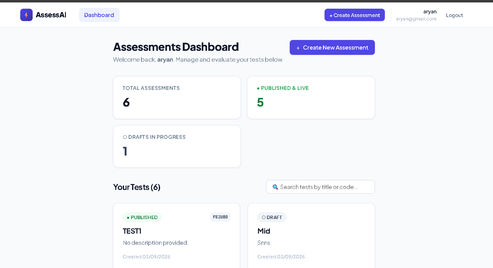
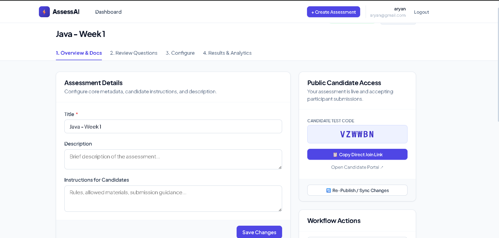
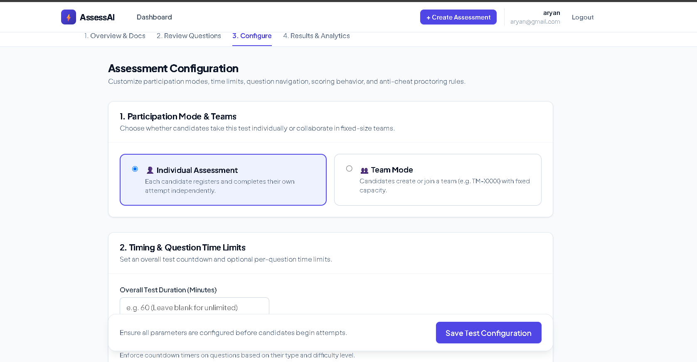
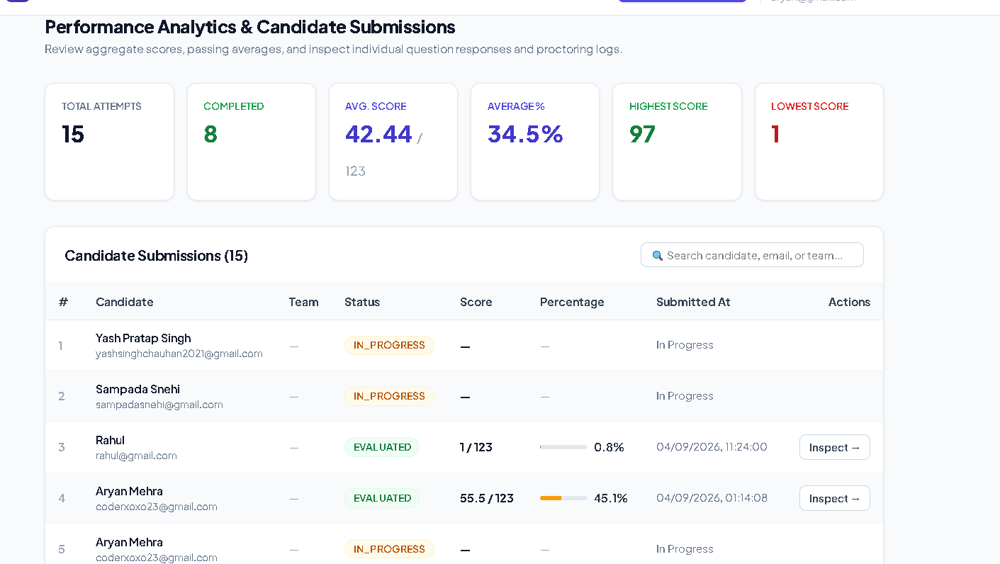

# AssessAI

> AI-powered assessment creation, delivery, and evaluation platform.



AssessAI is a full-stack online assessment platform that allows educators, instructors, and organizations to create assessments from existing question documents using AI.

Creators can upload a Microsoft Word `.docx` document, automatically generate structured questions using Gemini AI, review and edit them, configure assessment rules, publish the assessment, and share a unique link with students.

Students can then access the assessment, complete it in a controlled test-taking environment, and submit their responses for evaluation.

---

## 🚀 Live Platform

**AssessAI is currently live with the complete V1 assessment workflow.**

The current V1 supports the complete flow:

```text
Creator
   │
   ▼
Create Assessment
   │
   ▼
Upload DOCX
   │
   ▼
AI Question Generation
   │
   ▼
Review & Edit Questions
   │
   ▼
Configure Assessment
   │
   ▼
Publish
   │
   ▼
Generate Public Link
   │
   ▼
Student Takes Assessment
   │
   ▼
Evaluation
   │
   ▼
Results & Analytics
```
---

# ✨ Key Features

## 🤖 AI-Powered Question Generation

Creators can upload a Microsoft Word `.docx` question document and use Gemini AI to convert the document into structured assessment questions.

Supported question types include:

* Multiple Choice Questions
* True / False
* Short Answer
* Long Answer

Generated questions can contain:

* Question text
* Difficulty
* Topic
* Marks
* Negative marks
* Options
* Correct answer
* Expected answer
* Evaluation rubric

The AI-generated questions are treated as drafts until the creator reviews and publishes the assessment.

---

## 📝 Question Review & Editing

Creators maintain complete control over AI-generated questions.


Before publishing, creators can:

* Review questions
* Edit questions
* Add questions manually
* Delete questions
* Reorder questions
* Change question types
* Modify options
* Modify correct answers
* Modify expected answers
* Modify marks
* Modify negative marks
* Modify difficulty
* Modify topics
* Modify evaluation rubrics

This ensures that AI-generated content can be verified and customized before reaching students.

---

## ⚙️ Flexible Assessment Configuration

Assessments can be configured according to the creator's requirements.



Configuration options include:

* Assessment duration
* Per-question timing
* Start date and time
* End date and time
* Question navigation settings
* Marking configuration
* Negative marking
* Participation settings
* Other assessment rules

This allows the same platform to be used for classroom tests, practice assessments, examinations, interviews, and other evaluation workflows.

---

# 🔗 Public Assessment Links

After configuring an assessment, creators can publish it and generate a public candidate access link.

The creator can share this link directly with students.

```text
Creator
   │
   ▼
Publish Assessment
   │
   ▼
Unique Assessment Link
   │
   ▼
Student
   │
   ▼
Start Assessment
```

Students do not need access to the creator dashboard to participate.

---

# 👨‍🎓 Student Assessment Experience

Students receive a dedicated assessment interface designed specifically for taking tests.

The test-taking experience supports:

* Assessment instructions
* Participant information
* Question navigation
* Multiple choice questions
* True / False questions
* Short answers
* Long answers
* Timed assessments
* Question-level timing
* Assessment submission

The interface is designed to minimize distractions and keep the student focused on the assessment.

---

# 🛡️ Anti-Cheating Mechanism

AssessAI V1 includes a basic browser-level anti-cheating mechanism for controlled assessments.

## Fullscreen Enforcement

During an active assessment, the student is required to remain in fullscreen mode.

The assessment interface monitors fullscreen state during the test.

If the student exits fullscreen, it is treated as a violation.

```text
Start Assessment
       │
       ▼
Enter Fullscreen
       │
       ▼
Take Assessment
       │
       ├───────────────┐
       │               │
       ▼               ▼
Fullscreen            Exit Fullscreen
Maintained                 │
       │                   ▼
       │              Violation
       │                   │
       │                   ▼
       │              Auto Submit
       │
       ▼
Complete Assessment
       │
       ▼
Submit
```

### Violation Handling

When a fullscreen violation occurs:

1. The violation is detected.
2. The assessment is automatically submitted.
3. The student cannot continue the assessment normally.

This provides a basic controlled testing environment without requiring additional software installation.

> **Note:** This is a browser-level anti-cheating mechanism. It does not claim to provide complete proctoring or prevent all possible forms of cheating.

---

# ⏱️ Timed Assessments

AssessAI supports configurable assessment timing.

Creators can configure:

* Overall assessment duration
* Per-question timing
* Assessment start time
* Assessment end time

Timing is handled with backend validation so that the frontend timer is not the sole authority for determining whether an assessment is still active.

---

# 📊 Evaluation & Results

After students submit their assessments, responses can be evaluated and results are made available to the creator.


Results can include:

* Participant information
* Score
* Maximum score
* Percentage
* Question-wise performance
* Correct and incorrect responses
* Unanswered questions
* Evaluation feedback
* Attempt information

For subjective questions, AI-assisted evaluation can use:

* Expected answers
* Key points
* Evaluation rubrics
* Maximum marks

---

# 🔐 Authentication & Security

AssessAI uses Supabase Authentication for creator accounts.

The backend validates authenticated requests before allowing protected operations.

Security principles include:

* Authenticated creator access
* Server-side authorization
* User-level resource isolation
* Protected assessment management
* Protected question management
* Server-side timing validation
* Protected answer keys
* Environment-based secret management

A creator cannot access or modify another creator's assessments or questions through the protected API.

Participant-facing assessment APIs are designed to avoid exposing answer keys during an active assessment.

---

# 🏗️ System Architecture

```text
                         ┌─────────────────────┐
                         │       Creator       │
                         └──────────┬──────────┘
                                    │
                                    ▼
                         ┌─────────────────────┐
                         │      Vercel         │
                         │                     │
                         │ React + Vite        │
                         │ Creator UI           │
                         │ Student UI           │
                         └──────────┬──────────┘
                                    │
                                    │ HTTPS
                                    ▼
                         ┌─────────────────────┐
                         │       Render        │
                         │                     │
                         │ Node.js + Express   │
                         │ REST API            │
                         └───────┬───────┬─────┘
                                 │       │
                    ┌────────────┘       └────────────┐
                    ▼                                 ▼
          ┌──────────────────┐              ┌──────────────────┐
          │     Supabase     │              │    Gemini API    │
          │                  │              │                  │
          │ PostgreSQL       │              │ AI Question      │
          │ Authentication   │              │ Generation       │
          │ Storage          │              │ AI Evaluation    │
          └──────────────────┘              └──────────────────┘
```

---

# 🛠️ Technology Stack

## Frontend

* React
* Vite
* JavaScript
* CSS

## Backend

* Node.js
* Express.js
* REST API

## Database & Backend Services

* Supabase
* PostgreSQL
* Supabase Authentication
* Supabase Storage

## Artificial Intelligence

* Google Gemini API

## Deployment

* Vercel
* Render
* Supabase

---

# 📁 Project Structure

```text
assessment-platform/
│
├── client/
│   ├── public/
│   ├── src/
│   │   ├── assets/
│   │   ├── components/
│   │   ├── context/
│   │   ├── lib/
│   │   ├── pages/
│   │   ├── services/
│   │   ├── App.css
│   │   ├── App.jsx
│   │   ├── index.css
│   │   └── main.jsx
│   │
│   ├── .env
│   ├── .env.example
│   ├── eslint.config.js
│   ├── index.html
│   ├── package.json
│   ├── vercel.json
│   └── vite.config.js
│
├── server/
│   ├── src/
│   │   ├── config/
│   │   │   ├── env.js
│   │   │   └── supabase.js
│   │   │
│   │   ├── integrations/
│   │   │
│   │   ├── middleware/
│   │   │   └── auth.js
│   │   │
│   │   ├── modules/
│   │   │   ├── attempts/
│   │   │   ├── auth/
│   │   │   ├── configurations/
│   │   │   ├── documents/
│   │   │   ├── participants/
│   │   │   ├── public/
│   │   │   ├── questions/
│   │   │   ├── results/
│   │   │   ├── tests/
│   │   │   └── ...
│   │   │
│   │   ├── services/
│   │   └── app.js
│   │
│   ├── .env
│   ├── .env.example
│   ├── package.json
│   └── package-lock.json
│
├── database/
│
├── .gitignore
└── README.md
```

---

# 🔄 Assessment Creation Workflow

## Step 1: Create Assessment

The creator creates a new assessment from the dashboard.

```text
Dashboard
    ↓
Create Assessment
```

---

## Step 2: Upload Question Document

The creator uploads a Microsoft Word `.docx` document.

```text
DOCX
  ↓
Document Upload
  ↓
Text Extraction
```

---

## Step 3: Generate Questions

Gemini AI processes the extracted document content.

```text
Document
    ↓
Extracted Text
    ↓
Gemini AI
    ↓
Structured Questions
```

---

## Step 4: Review Questions

Generated questions are displayed to the creator.

The creator can modify the questions before publishing.

```text
AI Generated Questions
          ↓
     Review & Edit
          ↓
     Final Questions
```

---

## Step 5: Configure Assessment

The creator configures the assessment rules.

```text
Questions
    +
Timing
    +
Availability
    +
Marking
    +
Navigation
    ↓
Assessment Configuration
```

---

## Step 6: Publish

Once the assessment is ready, the creator publishes it.

Publishing makes the assessment available to participants according to its configured availability.

---

## Step 7: Share

AssessAI provides a public candidate access mechanism.

The creator shares the generated link with students.

---

## Step 8: Student Takes Assessment

The student:

```text
Open Link
    ↓
Read Instructions
    ↓
Start Assessment
    ↓
Answer Questions
    ↓
Submit
```

The assessment timer and configured rules remain active throughout the attempt.

---

## Step 9: Evaluation

Responses are processed according to the question type and configured assessment rules.

---

## Step 10: Results

The creator can access assessment results and analyze participant performance.

---

# 🧩 Supported Question Types

| Type         | Description                                                         |
| ------------ | ------------------------------------------------------------------- |
| MCQ          | Multiple choice question with four options                          |
| TRUE_FALSE   | True or False question                                              |
| SHORT_ANSWER | Short text response                                                 |
| LONG_ANSWER  | Detailed text response evaluated using expected answers and rubrics |

---

# 🗄️ Data Model

At a high level, AssessAI follows this relationship:

```text
Creator
   │
   └── Assessments
           │
           ├── Questions
           │
           ├── Configuration
           │
           ├── Participants
           │
           └── Attempts
                   │
                   ├── Answers
                   │
                   └── Results
```

Supabase PostgreSQL stores the structured assessment data while Supabase Authentication manages creator identity.

---

# 🔌 API Architecture

The backend follows a modular REST API architecture.

Major modules include:

```text
Authentication
       │
       ├── Tests
       │
       ├── Questions
       │
       ├── Documents
       │
       ├── Configurations
       │
       ├── Participants
       │
       ├── Attempts
       │
       ├── Results
       │
       └── Public Assessment Access
```

Protected endpoints use authentication middleware and server-side authorization.

---

# 💻 Local Development

## Prerequisites

Install:

* Node.js
* npm
* Git

You will also need:

* A Supabase project
* A Gemini API key

---

## Clone the Repository

```bash
git clone <YOUR_REPOSITORY_URL>

cd assessment-platform
```

---

## Install Frontend Dependencies

```bash
cd client
npm install
```

Start the development server:

```bash
npm run dev
```

---

## Install Backend Dependencies

Open another terminal:

```bash
cd server
npm install
```

Start the backend:

```bash
npm run dev
```

---

# 🔐 Environment Variables

Environment variables are required for local development and production.

## Frontend

Create:

```text
client/.env
```

Configure the required frontend variables used by the application.

Example:

```env
VITE_API_URL=http://localhost:5000
VITE_SUPABASE_URL=your_supabase_url
VITE_SUPABASE_ANON_KEY=your_supabase_anon_key
```

---

## Backend

Create:

```text
server/.env
```

Configure the required backend variables.

Example:

```env
SUPABASE_URL=your_supabase_url
SUPABASE_SERVICE_ROLE_KEY=your_supabase_service_role_key
GEMINI_API_KEY=your_gemini_api_key
```

Use the exact environment variable names expected by the current application configuration.

### Important

Never commit real credentials or `.env` files to GitHub.

---

# ☁️ Deployment

AssessAI uses a separated frontend and backend deployment architecture.

```text
                    Internet
                       │
                       ▼
              ┌─────────────────┐
              │     Vercel      │
              │ React + Vite    │
              └────────┬────────┘
                       │
                       ▼
              ┌─────────────────┐
              │     Render      │
              │ Node + Express  │
              └────────┬────────┘
                       │
                ┌──────┴──────┐
                ▼             ▼
           Supabase        Gemini
```

### Frontend

The React/Vite frontend is deployed on Vercel.

### Backend

The Node.js/Express backend is deployed on Render.

### Database

Supabase provides the PostgreSQL database.

### Authentication

Supabase Authentication manages creator authentication.

### AI

Gemini provides AI-powered question generation and subjective answer evaluation.

---

# 🎯 V1 Scope

The current release focuses on the core assessment workflow.

### Creator

* Creator authentication
* Assessment creation
* Assessment dashboard
* DOCX upload
* AI question generation
* Question review
* Question editing
* Question deletion
* Question reordering
* Manual question creation
* Assessment configuration
* Assessment publishing
* Public assessment link
* Results and analytics

### Student

* Public assessment access
* Assessment instructions
* Participant information
* Individual participation
* Team participation where configured
* Multiple question types
* Assessment timer
* Per-question timing
* Question navigation
* Answer submission
* Fullscreen enforcement
* Automatic submission after fullscreen violation

### Evaluation

* Objective question evaluation
* Subjective answer evaluation
* Expected answers
* Evaluation rubrics
* Score calculation
* Results

---

# 🛡️ Security & Assessment Integrity

AssessAI follows a server-authoritative approach for important assessment operations.

The system is designed to prevent the frontend from being the sole source of truth for:

* Authentication
* Resource ownership
* Assessment availability
* Timing
* Submission

Sensitive assessment information such as answer keys and evaluation data should remain protected from participants during an active assessment.

---

# 🔮 Future Roadmap

The current V1 establishes the core assessment platform.

Potential future improvements include:

* Advanced proctoring
* Webcam-based monitoring
* Tab-switch detection
* Additional browser integrity checks
* Plagiarism detection
* Advanced analytics
* Adaptive assessments
* Coding questions
* Code execution environments
* Certificates
* Assessment templates
* Question banks
* Advanced team assessments
* Competitive battle-based assessments
* Mobile applications

These features are outside the current V1 scope.

---

# 📈 Project Status

**V1: Live and operational**

The core workflow is currently implemented:

```text
┌──────────────────────────────────────────┐
│              ASSESSAI V1                 │
├──────────────────────────────────────────┤
│                                          │
│ Creator Authentication          ✅       │
│ Assessment Creation             ✅       │
│ DOCX Upload                     ✅       │
│ AI Question Generation          ✅       │
│ Question Review                 ✅       │
│ Question Editing                ✅       │
│ Question Deletion               ✅       │
│ Question Reordering             ✅       │
│ Manual Question Creation        ✅       │
│ Assessment Configuration        ✅       │
│ Assessment Publishing           ✅       │
│ Public Assessment Access         ✅       │
│ Timed Assessments                ✅       │
│ Student Assessment Interface     ✅       │
│ Fullscreen Enforcement           ✅       │
│ Violation Auto-Submission        ✅       │
│ Evaluation                       ✅       │
│ Results & Analytics              ✅       │
│                                          │
└──────────────────────────────────────────┘
```

---

# 🤝 Contributing

Contributions and improvements are welcome.

To contribute:

1. Fork the repository.
2. Create a feature branch.
3. Make your changes.
4. Test the changes locally.
5. Commit your changes.
6. Open a pull request.

Please keep pull requests focused and avoid introducing unrelated changes.

---


# 🙌 Acknowledgements

AssessAI is built using:

* React
* Vite
* Node.js
* Express.js
* Supabase
* PostgreSQL
* Google Gemini
* Vercel
* Render

---

## AssessAI

**Create assessments faster. Review with confidence. Evaluate smarter.**


